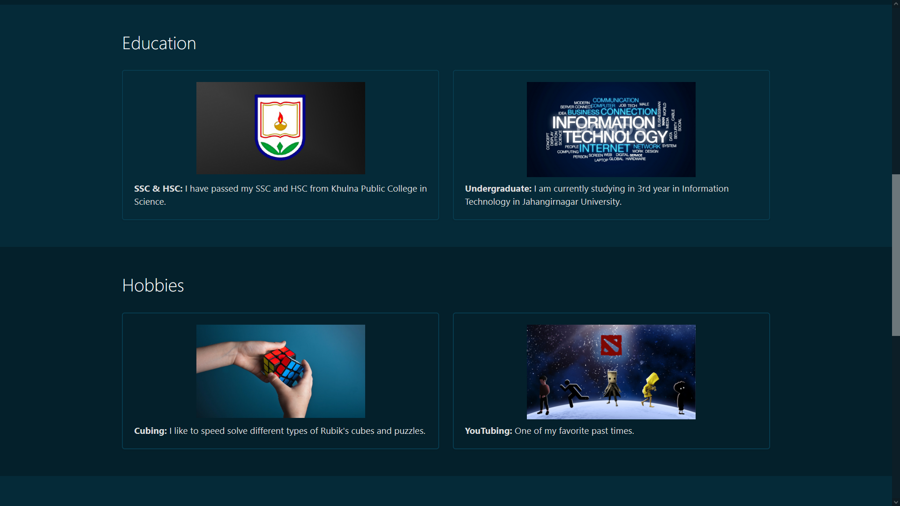
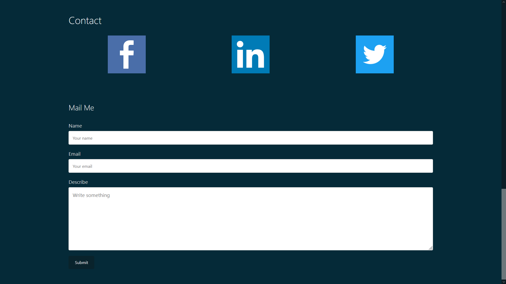

# Portfolio

This is a small project made with HTML and CSS. I did it for a lab course in my university showcasing my portfolio.

## Home
This is the only page. It contains 5 sections: About, Skills, Education, Hobbies, and Contant.

  
   

About and Skills

 
 

  
   

Education and Hobbies

 
 

  
   

Contact Form

